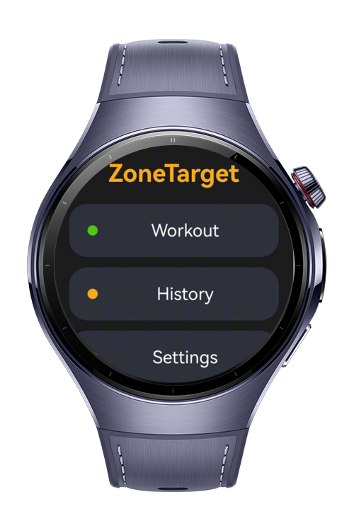
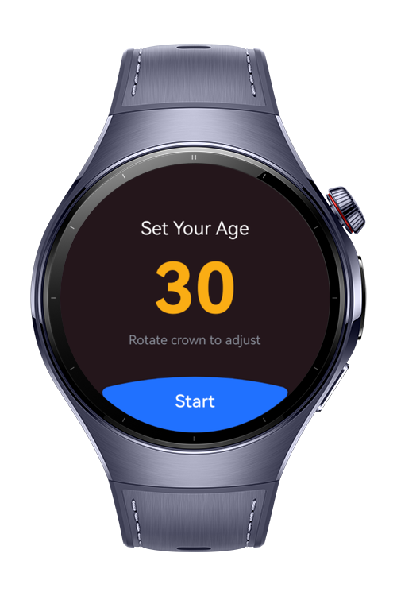
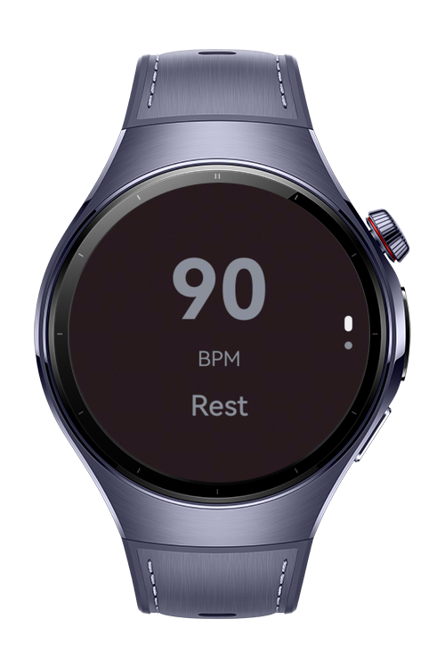

> **Note:** To access all shared projects, get information about environment setup, and view other guides, please visit [Explore-In-HMOS-Wearable Index](https://github.com/Explore-In-HMOS-Wearable/hmos-index).

# ZoneTarget

This application (ZoneTarget) is a comprehensive exercise app on wearable ecosystem which users can track/listen zones according to their real-time bpm data. 

# Preview

<div>
    
    
    
    
</div>

# Use Cases

- Measure real time bpm and step count.
- Measurement of bpm and calculation of heart rate zones.
- All in one exercise tracking app on smart wearable devices with various features.
- App gives users audio feedback when the current zone changes.
- Send training summary data from watch to phone using wearengine.

# Tech Stack

- **Languages**: ArkTS
- **Frameworks**: HarmonyOS SDK 6.0.0(20)
- **Tools**: DevEco Studio Version 6.1.1.280
- **Libraries**: @kit.WearEngine,
@kit.PerformanceAnalysisKit,
@kit.MediaKit,
@kit.ArkData,
@kit.ArkUI

# Directory Structure

```
└── main
    └── ets
        └── database
            ├── WorkoutRdbHelper.ets
        └── entrybackupability
            ├── EntryBackupAbility.ets
        └── hiwearmainability
            ├── HiWearMainAbility.ets
        └── model
            ├── WorkoutRecord.ets
            ├── WorkoutSession.ets
            ├── ZoneCalculator.ets
        └── pages
            ├── History.ets
            ├── Index.ets
            ├── Settings.ets
            ├── Setup.ets
            ├── Summary.ets
            ├── Workout.ets
            ├── WorkoutDetail.ets
        └── services
            ├── AppSettings.ets
            ├── AudioService.ets
            ├── WearEngineService.ets
        └── utils
            ├── CommonUtils.ets
    └── resources
        └── base
            └── element
                ├── color.json
                ├── float.json
                ├── string.json
            └── media
                ├── background.png
                ├── foreground.png
                ├── layered_image.json
                ├── startIcon.png
            └── profile
                ├── backup_config.json
                ├── main_pages.json
        └── dark
            └── element
                ├── color.json
        └── rawfile
            ├── zone_1.mp3
            ├── zone_2.mp3
            ├── zone_3.mp3
            ├── zone_4.mp3
            ├── zone_5.mp3
    └── module.json5
```

# Constraints and Restrictions

## Supported Devices

- Huawei Watch 5
- Huawei Watch Ultimate 2

# License

**ZoneTarget** is distributed under the terms of the MIT License
See the [LICENSE](./LICENSE) for more information.